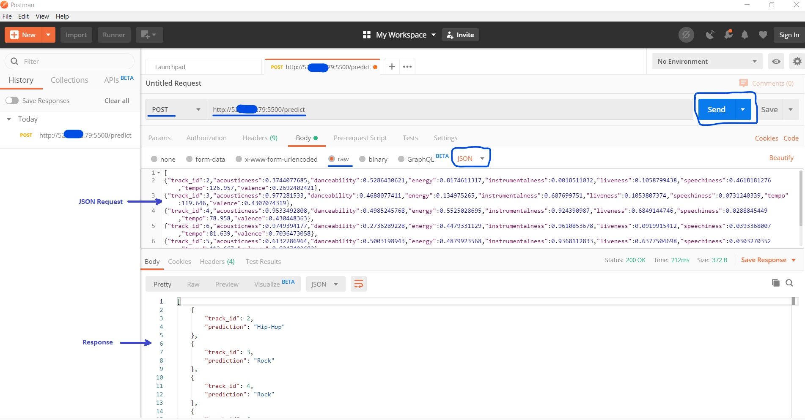

# Deploying-a-Model-Into-Production
This repository describes the steps taken to deploy a model trained and tested with scikit-learn python library. This model predicts if a given song is of type "Rock" or "Hip-Hop" based on certain features. Check link : https://github.com/femtonelson/Classifying-Songs-Genres-From-Audio-Data .This is done with a web service development framework in Python known as Flask.

# Introduction to Model Deployment
A model contains information on the type of algorithm used and relevant coefficients calculated during its training. One of the key requirements of a model is that 
it needs to be portable, so as to transfer functionality flawlessly from one environment to a different one. 

The majority of models are built in Python/R but the applications that consume these models may belong to different technology stacks. It is thus necessary to have an interface
between different technologies with a standard exhange format. APIs (Application Programming Interface) provide this linkage. They can run as web applications using Hypertext Transfer Protocol (HTTP) request messages, 
along with a definition of the structure of response messages, usually in an Extensible Markup Language (XML) or JavaScript Object Notation (JSON) format. 
In this excercise, the Flask API will be used. It has an inbuilt light-weight web server which needs minimal configuration, and it can be controlled from Python code.

Flask web server will be installed on a publicly accessible AWS instance and configured to respond to JSON requests (sent by a Postman API client) with song type predictions.  

# Model Deployment Procedure

- Setup AWS EC2 instance in a public subnet with a public IP address
- Install and configure Flask on this machine, to be accessible on port 5500 for example
- Run Postman API client and send requests to the server to obtain predictions

Three files obtained from the model training excercise should be available in the working directory on the server :
- data_preprocess.py : Provides the function which pre-processes an input pandas dataframe and returns a numpy array with the reduced features

<details>
<summary>Content of data_preprocess.py</summary>
<p>
```

def data_preprocess(input_df):

    # This function processes an input pandas dataframe and returns a numpy array with the reduced features
    # Columns expected : track_id, acousticness, danceability, energy, instrumentalness, liveness, speechiness, tempo, valence

    # Filter out quantitative features and drop 'track_id'
    features = input_df.drop(columns=['track_id'])

    # Import the StandardScaler class and instanciate it
    from sklearn.preprocessing import StandardScaler
    scaler = StandardScaler()

    # Scale the quantitative features i.e replace each value of a feature x by [(value-mean(x))/std(x)]
    scaled_train_features = scaler.fit_transform(features)

    # Import PCA class
    from sklearn.decomposition import PCA

    # Perform PCA with the chosen number of components = 6 and project data onto components
    n_components = 6
    pca = PCA(n_components, random_state=10)
    pca.fit(scaled_train_features)
    pca_projection = pca.transform(scaled_train_features)
    # Return the reduced numpy array with n_components = 6 features
    return pca_projection
```</p>
</details>

- logreg.pkl : The trained Logistic Regression model
- logreg_columns.pkl : The column names of the input dataframe

Also
- The API configuration file : api.py is required in this directory

# Setup a publicly accessible AWS EC2 Instance and install Flask API Server
```
# Install Flask and necessary Python packages
$sudo apt-get update
$sudo apt install python3-pip
$sudo pip3 install flask
$sudo pip3 install pandas
$sudo pip3 install joblib
$sudo pip3 install -U scikit-learn 
```

# Configure Flask application, configuration file : [api.py](/api.py)

<details>
<summary>Content of api.py</summary>
<p>

```python
# Dependencies
from flask import Flask, request
import joblib
import traceback
import pandas as pd
import numpy as np

# Import the data pre-processing toolbox function from "data_preprocess.py"
from data_preprocess import data_preprocess

# Create API instance
app = Flask(__name__)

@app.route('/predict', methods=['POST'])  # This decorator indicates which URL "/predict" should trigger the execution of the func predict
def predict():
    if logreg:
        try:
            # Read input json request into a dataframe and fill dummy values
            json_ = request.json

            # Print the content of JSON request to server terminal
            print(json_)

            input_df = pd.DataFrame(json_)

            # Process the input dataframe and return a reduced numpy array
            reduced_arr = data_preprocess(input_df)

            # Run the prediction on the reduced array
            prediction = list(logreg.predict(reduced_arr))

            # Create an output dataframe to contain track_id and prediction for each track id
            output_df = input_df[['track_id']]
            output_df['prediction'] = prediction

            # Print result in server terminal
            print(output_df)

            # Convert the output to JSON and send to client
            return output_df.to_json(orient='records')

        except:

            return jsonify({'trace': traceback.format_exc()})
    else:
        print ('Train the model first')
        return ('No model here to use')

if __name__ == '__main__':  # To be executed when "sudo python3 api.py" is run in server terminal

    logreg = joblib.load("logreg.pkl") # logreg.pkl"
    print ('Model loaded')
    model_columns = joblib.load("logreg_columns.pkl") # Load "logreg_columns.pkl"
    print ('Model columns loaded')

    # Run FLask on port 5500 and listen to requests from all IP addresses
    app.run(port = 5500, debug=True, host= '0.0.0.0')
```
</p>
</details>


```
# Run "sudo python3 api.py" in server terminal to load the model and start the Flask server
$sudo python3 api.py
(base) ubuntu@ip-10-0-4-193:~$ sudo python3 api.py
Model loaded
Model columns loaded
 * Serving Flask app "api" (lazy loading)
 * Environment: production
   WARNING: This is a development server. Do not use it in a production deployment.
   Use a production WSGI server instead.
 * Debug mode: on
 * Running on http://0.0.0.0:5500/ (Press CTRL+C to quit)
 * Restarting with stat
Model loaded
Model columns loaded
 * Debugger is active!
 * Debugger PIN: 150-894-586
```


# Send JSON Requests to Flask in API client - Postman

- Download Postman : https://www.getpostman.com/downloads/

- Set 'POST' method for forwarding JSON requests as specified in "api.py" and provide the URL of the prediction server : http://PublicIP.Of.EC2.Instance:5500/predict

- Set the Request Format as "JSON".

NB : For principal component analysis algorithm to work, the number of components chosen in the training process : n_components = 6 must not exceed min(n_samples, n_features).
Given the number of features is 8 : acousticness, danceability, energy, instrumentalness, liveness, speechiness, tempo, valence
We must provide at least 06 samples in a prediction request on Postman.

- [Example of Request](/Example-of-request.json), [Example of Response](/Example-of-response.json)



Useful links : 
- https://www.datacamp.com/community/tutorials/machine-learning-models-api-python
- https://blog.cloudera.com/putting-machine-learning-models-into-production/
